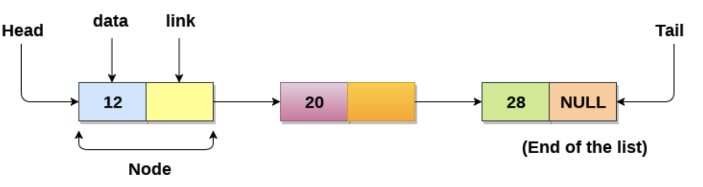

## 1. Array

1. Declare an array

```
String[] cars;

String[] cars={"Volvo","BMW","Ford"};
```

```
;int[] myNum = {10, 20, 30}
```

2. Acess the Elements of an Array

```
String[] cars = {"Volvo","BMW","Ford"};
System.out.println(cars[0]);
```

3. Change an Array Element

```
cars[0] = "Opel"
```

4. Array Length

```
System.out.println(cars.length);
```

## 2. String

1. Define a String

   ```
   String greeting = "Hello";
   ```
2. String Length

```
String txt = "abcdefg";
System.out.println("The length of txt string is: "+txt.length());
```

3. String Methods

(1) toUpperCase() and toLowerCase()

```
txt.toUpperCase()
txt.toLowerCase()
```

(2) find a character in a String

indexOf(): returns the index (the position) of the first occurrence of a specified text in a String **(including whitespace)**

```
String txt = "Please locate where 'locate' occurs!";
System.out.println(txt.indexOf("locate"))// Outputs 7
```

(3) charAt()

returns the character at the specified index in a string

```
String myStr = "Hello"
char result = myStr.charAt(0);//Outputs: 0
```

(4) compareTo() and compareToIgnoreCase()

compares two strings lexicographically

-> **based on the Unicode value** of each character in the strings

-> returns 0: two strings equal

returns >0: the string has more characters than other

return <0: the string has less characters than other

```
String myStr1 = "Hello";
String myStr2 = "Hello";
System.out.println(myStr1.compareTo(myStr2)); // Returns 0 because they are equal
```

(5) equals() and equalsIgnoreCase()

compares two strings, and returns true if the strings are equal, and false if not

```
String myStr1 = "Hello";
String myStr2 = "Hello";
String myStr3 = "Another String";
System.out.println(myStr1.equals(myStr2)); // Returns true because they are equal
System.out.println(myStr1.equals(myStr3)); // false
```

(6) concat()

appends a string to the end of another string

```
String firstName = "John ";
String lastName = "Doe";
System.out.println(firstName.concat(lastName));
```

(7) endsWith() and startsWith()

Checks whether a string ends/starts with the specified character(s)

(8) hashcode()

Returns the hash code of a string

(9) isEmpty()

Checks if a string is empty or not

(10) replace()

it searches a string for a specified character and returns a new string where the specified characters are replaced

```
String myStr = "Hello";
System.out.println(myStr.replace('l', 'p'));
```

* input should be char

(11) trim()

remove whitespace from both sides of a string

```
String myStr = "       Hello World!       ";
System.out.println(myStr);
System.out.println(myStr.trim());
```

(12) Convert string to int

```
String str = "25";
int number = Integer.parseInt(str);
```

Conver string to integer

```
String str = "25";
Integer number = Integer.valueOf(str);
```

(13) Convert int to string

```
int number = 5;
String str = String.valueOf(number);
```

## 3. Linked List

1. Definition: a collection of objects (**called nodes**) that are randomly stored in the memory.

Node contains 2 fields: (1) data stored at the particular address (2) pointer which contains the address of the next node in the memory




2. Uses of Linked List
